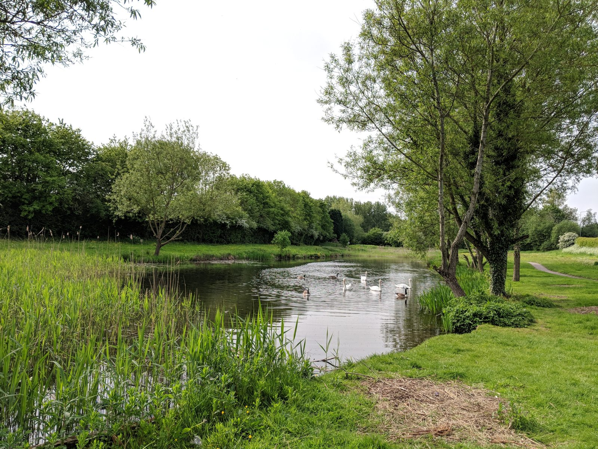
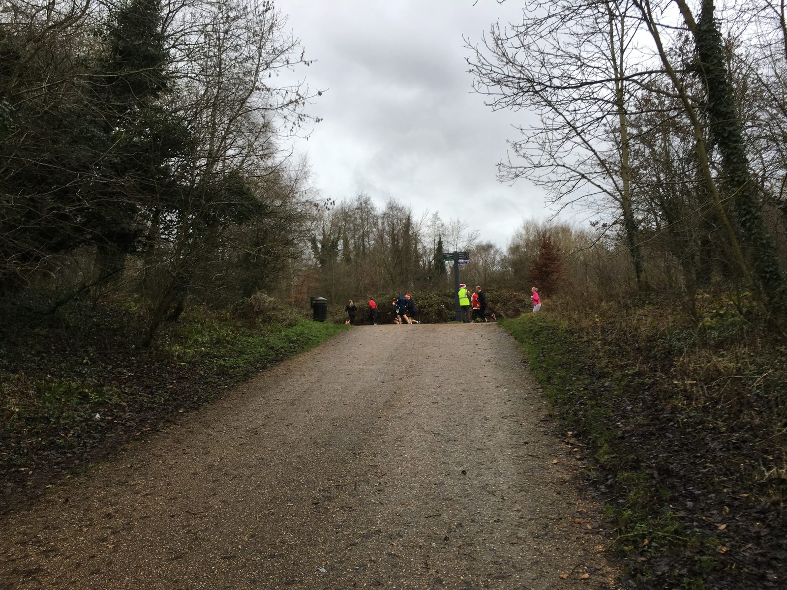
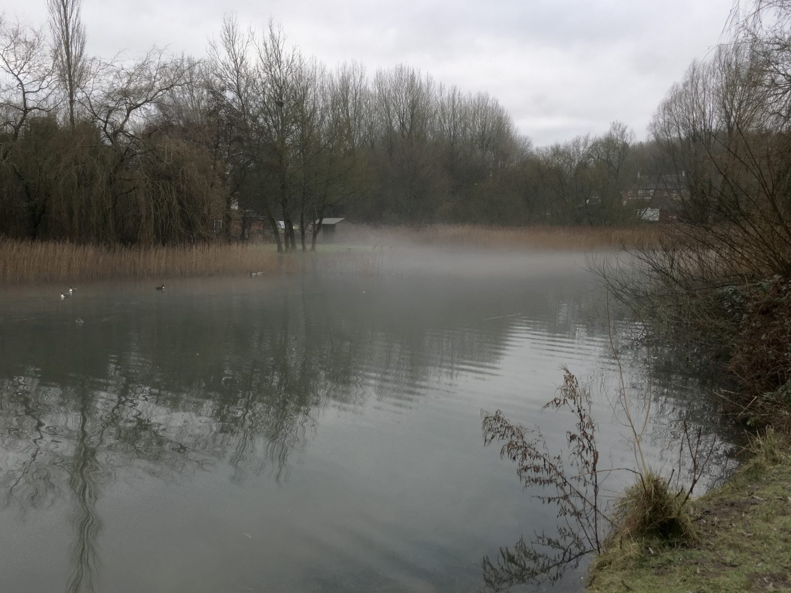

# Celebrate Telford Town Park Together

Join FOTTP to support, enjoy, and protect the natural beauty and lively spirit of Telford Town Park. Engage with events, volunteer, and connect with your community in a welcoming green space. It will only cost you time.

[Become a Member](/become-a-member/)

## Growing Our Community Spirit

Friends of Telford Town Park brings neighbours and visitors alike to enrich, restore, and celebrate this cherished green space. We organise events, fundraising, and activities that inspire community pride and environmental care.

<!-- TODO: verify these figures with the committee before publishing -->

- **200+** members active since launch
- **30+** Friends events held annually
- **100+** restoration projects completed

## Active Community Engagement

Volunteer in fun and fulfilling events, workshops, and restorations designed for all ages to enjoy and contribute.

## Park Restoration Projects

Support vital conservation efforts including planting, habitat restoration, and park maintenance. Give our park the love it deserves!

## Innovative Interactive Features

Explore QR-guided trails, digital park maps, and interactive resources enhancing visitor experience.

[Meet the Team](/about-us/)
