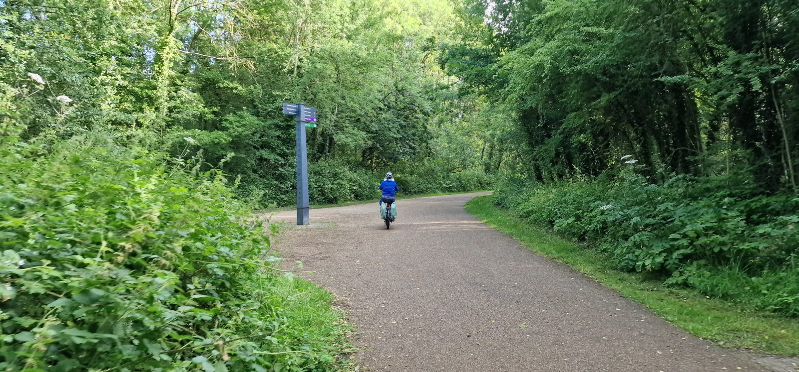
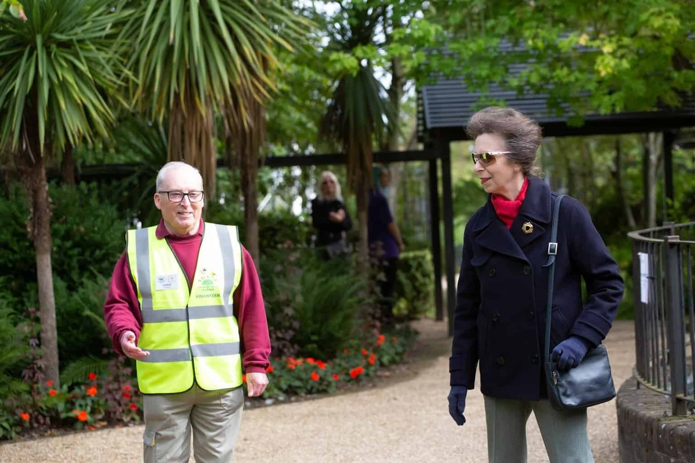
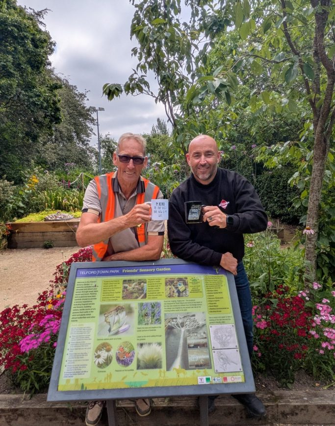
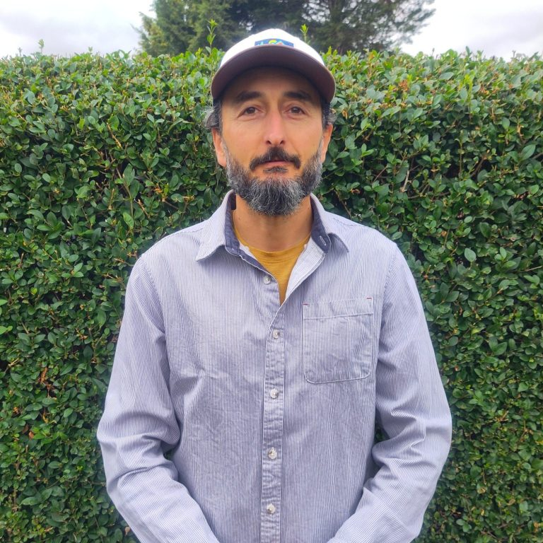
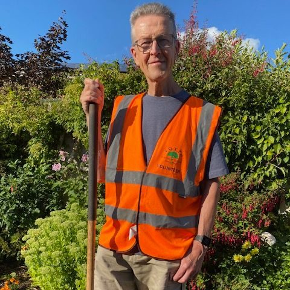

## Our Story and Mission

Friends of Telford Town Park was founded to unite people who cherish this unique green space. Our mission is to support restoration, promote activities, and foster a community spirit that ensures the park remains a vibrant, welcoming destination for all generations.

## Our History

Friends of Telford Town Park was founded in 2003 by a small group of three people who felt the park needed extra care and attention, and was formally constituted in July 2004. Telford Town Park covers around 150 hectares (400 acres) — one of the largest urban parks in Europe, and often called "the jewel in the crown of Telford."

The park has won the Green Flag Award and "Best UK Park" at the Fields in Trust awards. Photos of the awards are in the [Recognition and awards gallery](/gallery/recognition-and-awards/).

### Milestones

- **October 2010** — The Friends reopened the Crannog on Grange Pool as a nature-watching site, with a new bridge paid for by a £2,760 "Awards for All" lottery grant, a new path and a living willow hide. More in [Earlier projects](/our-projects/#earlier-projects).
- **23 November 2011** — After five years of campaigning by the Friends, including three applications for village green status, the deeds were signed making the Arena a Queen Elizabeth II Field, protected from development by Fields in Trust. A plaque marking it was unveiled at the top of the steps down into the Arena on 19 July 2012.
- **28 November 2013** — Jolly Green Day, a free outdoor event the Friends held on the Arena with Telford Green Spaces Partnership on 17 August, won Fields in Trust's national "Have a Field Day" award at a ceremony at Lord's Cricket Ground.
- **13 September 2014** — The Friends' Sensory Garden in the Chelsea Gardens was opened by the Mayor and David Wassell MBE, creator of the Chelsea Gardens. It was designed by the Friends' gardening group with landscape architect Teresa Rham, on the site of the old rose garden.
- **2015** — Telford Town Park was named UK's Best Park 2015 at the Fields in Trust awards.
- **2016** — The musical fountain in the Chelsea Gardens, silent for years, was restored with a £49,440 grant from the Suez Communities Trust.
- **2017** — The Friends built a bug hotel in the Chelsea Gardens with a grant from the People's Postcode Lottery.
- **21 April 2018** — The Friends held the first Sakura (cherry blossom) festival in the Maxell Cherry Garden, as part of Telford's 50th anniversary. The same year they started the memory leaf tree in the Sensory Garden, which raised almost £500 for charities.
- **June 2020** — The Friends received the Queen's Award for Voluntary Service.
- **28 September 2020** — HRH The Princess Royal visited the Town Park, where she was shown around the Chelsea and Maxell Gardens and planted a commemorative tree.
- **30 September 2022** — Covid had made a celebration impossible in 2020, so the Queen's Award was formally presented at the Holiday Inn Telford by Anna Turner, Lord-Lieutenant of Shropshire.
- **24 May 2023** — The Lord-Lieutenant opened the new Coronation Garden in the Chelsea Gardens, created by the Friends with funding from Telford & Wrekin Council's King's Coronation Celebration Fund.
- **29 September 2023** — The Friends celebrated 20 years of service at the Ramada Hotel, joined by the High Sheriff of Shropshire, Mandy Thorn MBE.
- **August 2026** — The Friends became a [registered charity](/news/2026-09-19-registered-charity/) in England & Wales (no. 1219196).

### Chairs

- **Chris Pettman** — the Friends' longest-serving chair, from 2006 to 2024, apart from a spell from April 2014
- **John Trubshaw** — elected at the AGM on 9 April 2014
- **Adrian Smith** — chair since 2024

See more photos of the day in the [Royal visit gallery](/gallery/royal-visit/).

## Meet Our Dedicated Team

We have a wonderfully committed team here at the Friends of Telford Town Park.

### Adrian Nimara

I was driving for Simmonds Transport when the company started collaborating with FOTTP. Getting to know the volunteers, I admired their dedication to maintaining and improving the park, so I've joined straight away. I am now semi-retired and it gives me immense joy to spend my free time working in the park along the Friends.

### Adrian Smith

68-year-old father of one and grandfather of two from Stirchley.

"I enjoy organising things, but I had no intention of becoming chairman, now I am, I've got this vision of taking it to the next step."

I used to be chairman of the Friends of Dawley CofE Primary School. I helped organise its popular fun day after I moved to Telford from Stourbridge in 1983, and have been a member of the FOTTP for four years.

I joined after retiring from my role as a supervisor at Ampacet in Halesfield, and previously worked at Pork Farms in Market Drayton.

"The Town Park really is a glorious space and I'm eager to involve the community and get children more involved. I just want to ensure as many people as possible enjoy this brilliant asset we have. I want more people to have the opportunity to experience both the physical and mental health benefits of working on the gardens."

### Peter Bailey

I am Peter Bailey, the Treasurer of the Friends of Telford Town Park. I joined the Friends in 2020, just as we came out of the Covid lockdown. Having spent over 40 years in primary school education, as a teacher, head teacher and in teacher training, I retired in 2020 and was looking for a useful way to fill my time, so I approached the Friends.

I have always loved gardening and working outside; if I had not become a teacher I think I would have wanted to run a garden nursery. I am also very interested in history, so helping in Telford Town Park I am often reminded of the industrial history of the area. I probably walk through the park at least five times a week. However, I enjoy coming to help in the park above all because it is a chance to meet people from a wide range of backgrounds, to make new friends and share a joke.

[Get in touch](/contact-us/)
