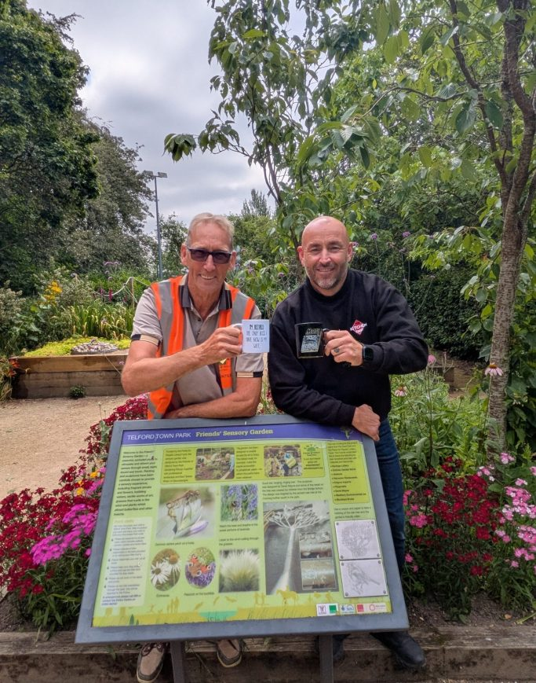
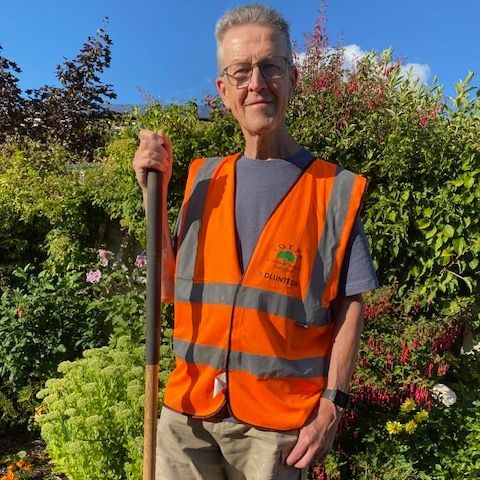

## Our Team

We have a wonderfully committed team here at the Friends of Telford Town Park.

### Adrian Namara

I was driving for Simmonds Transport when the company started collaborating with FOTTP. Getting to know the volunteers, I admired their dedication to maintaining and improving the park, so I've joined straight away. I am now semi-retired and it gives me immense joy to spend my free time working in the park along the Friends.

### Adrian Smith

68-year-old father of one and grandfather of two from Stirchley.

"I enjoy organising things, but I had no intention of becoming chairman, now I am, I've got this vision of taking it to the next step."

I used to be chairman of the Friends of Dawley CofE Primary School. I helped organise its popular fun day after I moved to Telford from Stourbridge in 1983, and have been a member of the FOTTP for four years.

I joined after retiring from my role as a supervisor at Ampacet in Halesfield, and previously worked at Pork Farms in Market Drayton.

"The Town Park really is a glorious space and I'm eager to involve the community and get children more involved. I just want to ensure as many people as possible enjoy this brilliant asset we have. I want more people to have the opportunity to experience both the physical and mental health benefits of working on the gardens."

### Peter Bailey

I am Peter Bailey, the Treasurer of the Friends of Telford Town Park. I joined the Friends in 2020, just as we came out of the Covid lockdown. Having spent over 40 years in primary school education, as a teacher, head teacher and in teacher training, I retired in 2020 and was looking for a useful way to fill my time, so I approached the Friends.

I have always loved gardening and working outside; if I had not become a teacher I think I would have wanted to run a garden nursery. I am also very interested in history, so helping in Telford Town Park I am often reminded of the industrial history of the area. I probably walk through the park at least five times a week. However, I enjoy coming to help in the park above all because it is a chance to meet people from a wide range of backgrounds, to make new friends and share a joke.

## Get in touch

Address: **TF3 4EP**

<!-- TODO: map embed is still an open decision — see docs/HANDOFF.md -->
