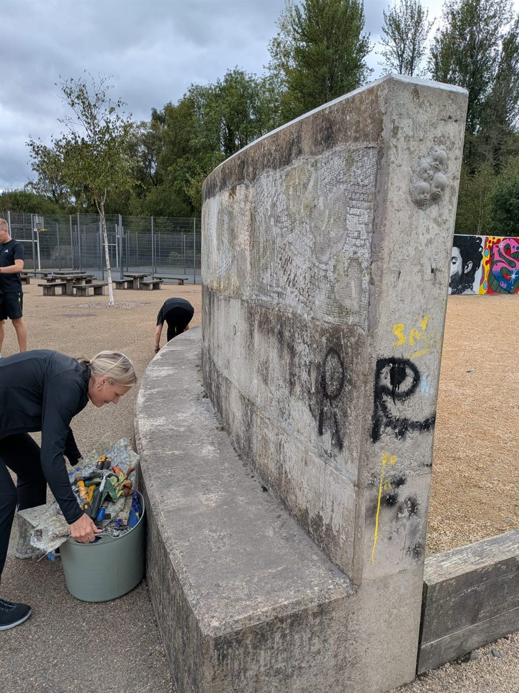
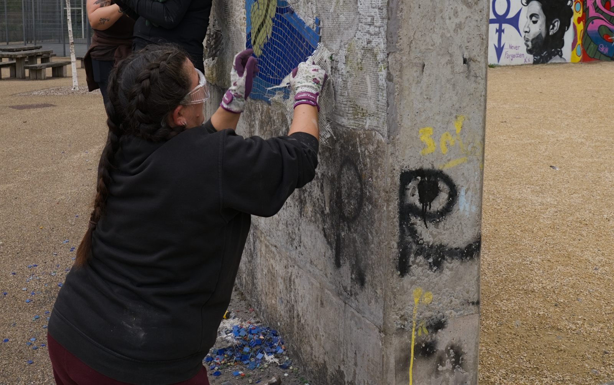
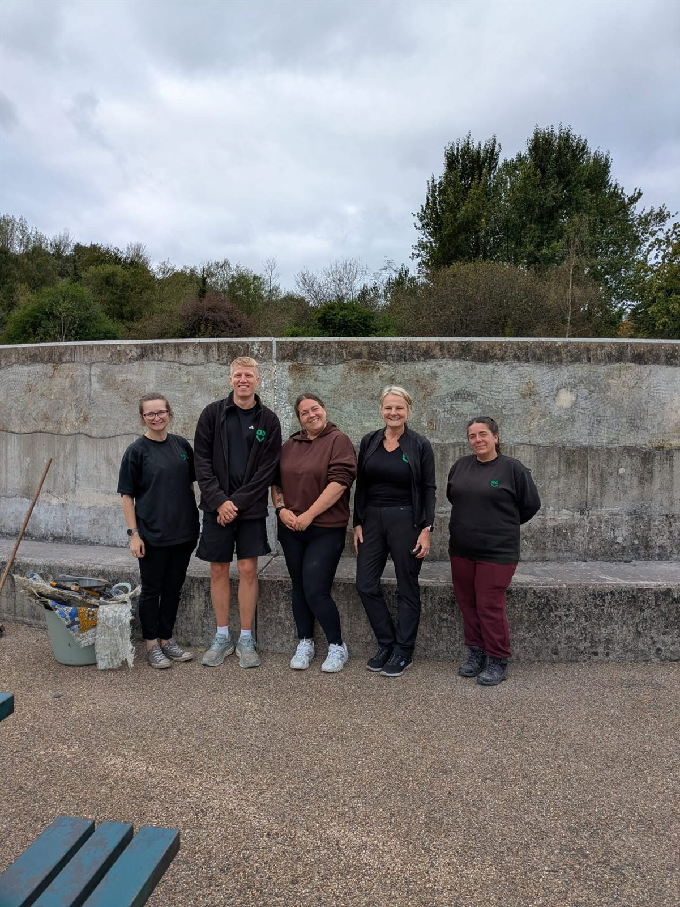

On Wednesday volunteers from AO joined us to help with clearing the mosaic wall that's in the Telford Town Park. It's opposite the children's play area near to the visitor centre. The wall is having an overhaul and new designs will be soon appearing.😁

The gang worked and laughed hard.

If you think you and/or your company would like to come and volunteer with us then [please get in touch](/contact-us/).
