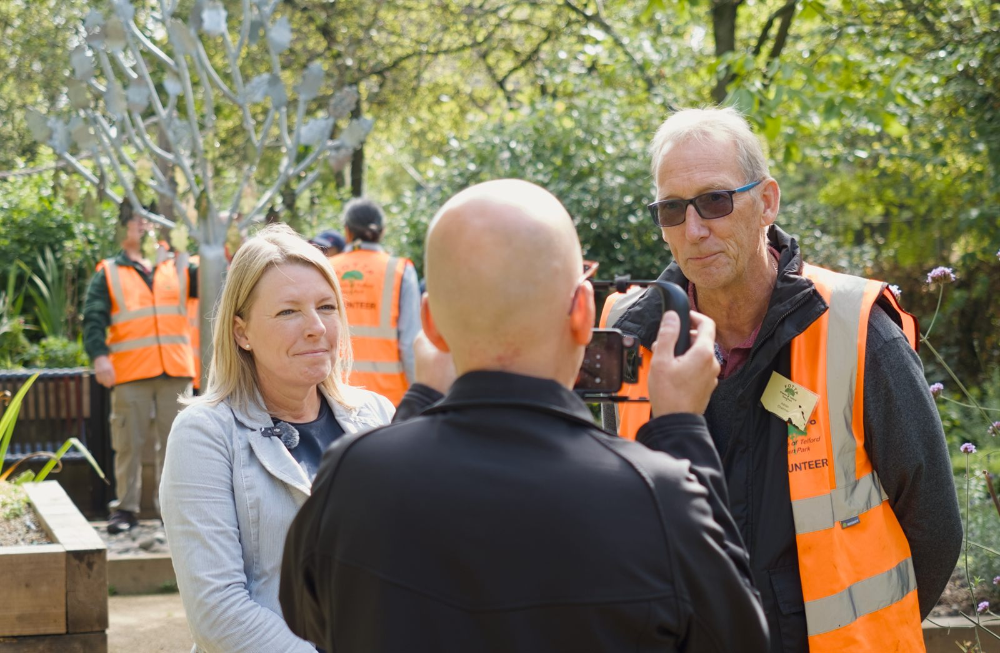

Friends of Telford Town Park became a Registered Charity in England & Wales in August 2026. Our registration number is **1219196**.

Charity status continues the mission of FOTTP: to promote, for the benefit of the public, the conservation, protection and improvement of the physical and natural environment of Telford Town Park in the Borough of Telford and Wrekin, for the benefit of the inhabitants of the borough of Telford and Wrekin and the surrounding area, by providing or assisting in the provision of facilities for recreation and other leisure time.

Some members gathered in Chelsea Gardens in the Town Park in mid-September to celebrate the new status.

*The Chair and a member of the council being interviewed for a local paper.*
