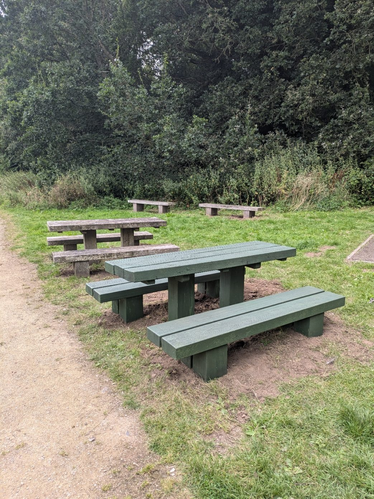

*By Adrian Smith, Chair*

Situated at the southern end of the Town Park, well away from the busy town centre end, the Crannog and Grange Pool are to some extent hidden gems of the Town Park.

Crannog is a Celtic word meaning "man-made island", and this crannog is exactly that. It was established in the 1990s to support the study of wildlife around Grange Pool. You can read more about the Crannog, and about the birds and wildlife that can be seen there, in [our Crannog leaflet](/archive/crannog-leaflet/crannog-leaflet.pdf).

With the support of Simmonds Transport, the Friends of Telford Town Park are now involved in a major project to repair and improve the facilities at the Crannog and the area around Grange Pool. This project will include:

- repairing the Onion seating area
- painting all benches and tables
- clearing all pathways around the pool
- creating a bird feeding and hide area on the Crannog
- repairing the bridge leading to the Crannog
- enhancing the car parking area
- making butterfly feeding stations and installing bird boxes around the area
- making good the banks, and planting new bushes to help support them
- enhancing the hedgeway along the path by planting more hedgerow trees
- making benches and tables around the pool and Crannog area for all to enjoy.

If you or your company would like to help with the project, [please get in touch](/contact-us/).
