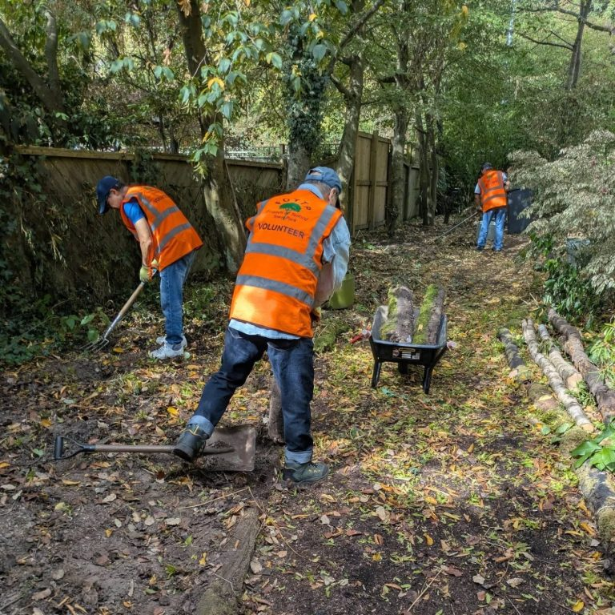
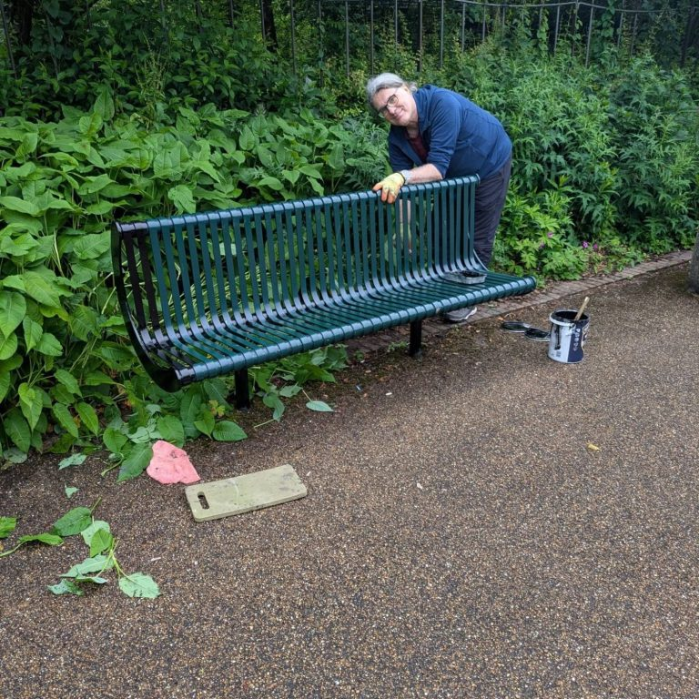

# Our Projects

Have a look at some of our vital restoration and maintenance efforts. We work tirelessly with our friends and volunteers to ensure Telford Town Park receives the love it deserves.

## Some of our recent work

### 19 August — Restoring the Chelsea and Maxel gardens

The Friends of Telford Town Park were hard at work in the gardens and then enjoying a well-earned cup of tea and a chat.

Thank you to everyone for helping to keep the Chelsea and Maxel gardens looking great.

### 3 August — Bench painting with Fujitsu

It was another lovely morning with the Fujitsu volunteers. We managed to paint many benches thanks to the hard work of the Friends and our volunteers.

Thanks everyone!

### 23 July — Clearing the overhanging trees from the footpaths

We had Friends and volunteers who helped to clear the overhanging trees from the old Stirchley Village School area and made it safe for pedestrians to walk along part of the footpath.

Thanks for all who helped out!

<!-- TODO: old site's photo for this entry was a stock image, not a real one — replace once sourced -->

## Gallery

Our volunteers are always helping us restore our beloved park! Past work sessions include:

- Tidying Grange Pool with Simmonds
- Bench painting with Fujitsu
- Kitchen building with Kitchen Depot
- Building the poly tunnel
- Clearing the snake and lizard sanctuary with Fujitsu
- Clearing the Stirchley old school entrance with Fujitsu

<!-- TODO: the old site's gallery images were only ever captured as small (50x67px) thumbnails by the JS lightbox widget — need full-resolution photos re-sourced for a proper gallery -->
