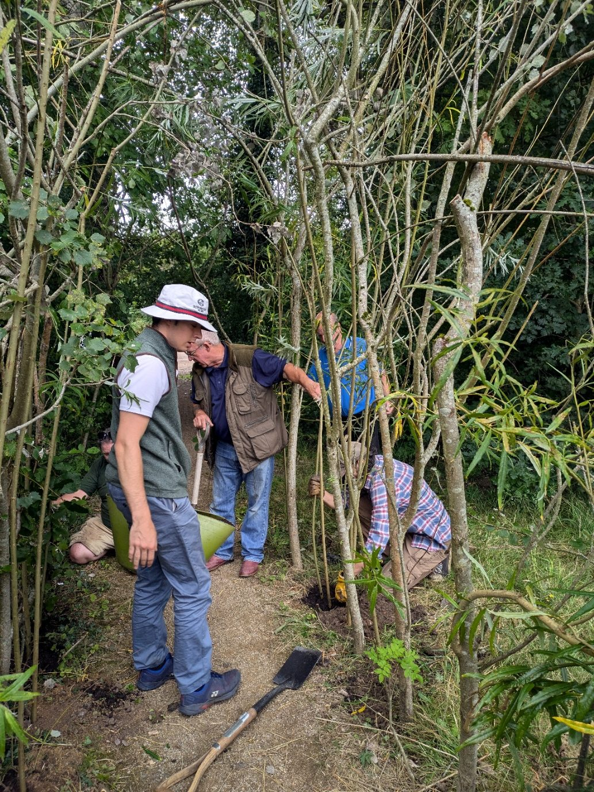
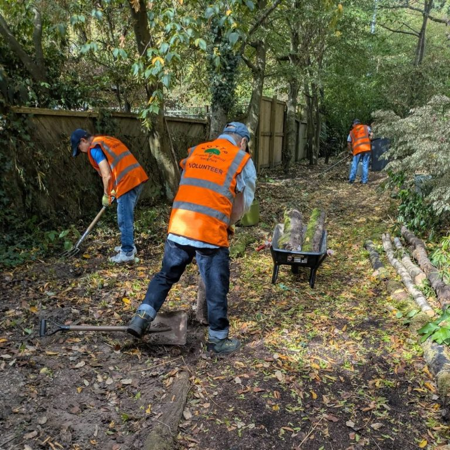
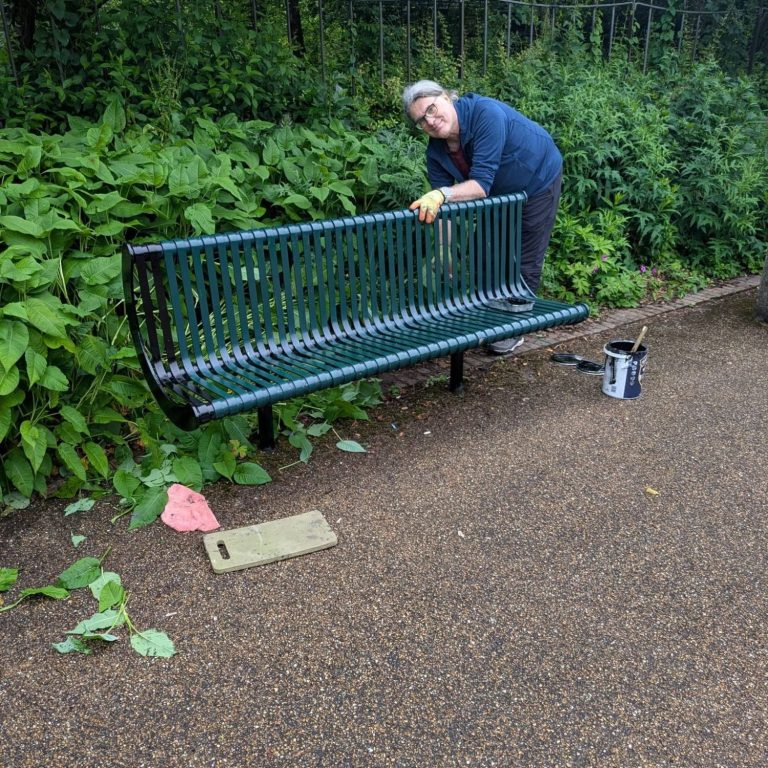
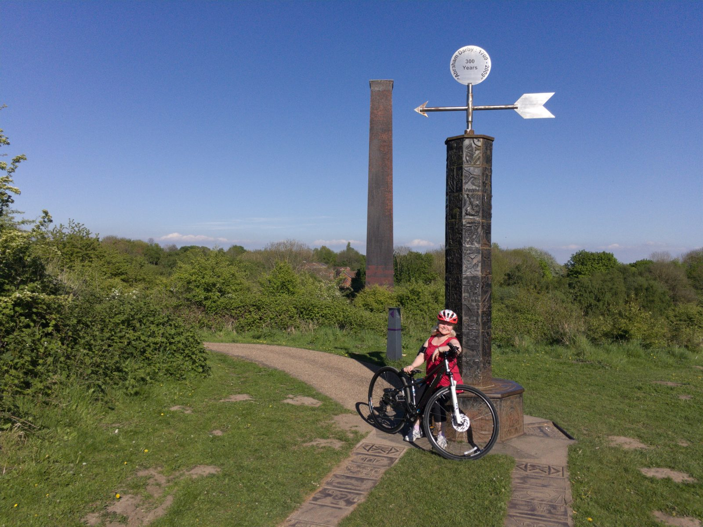
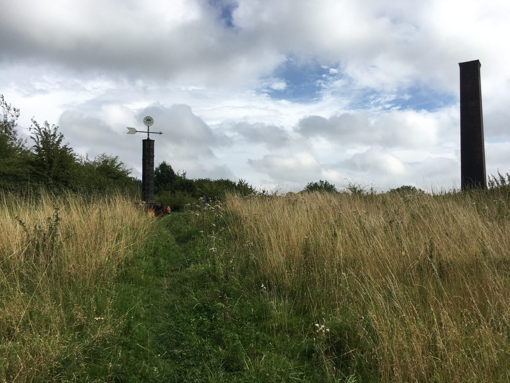
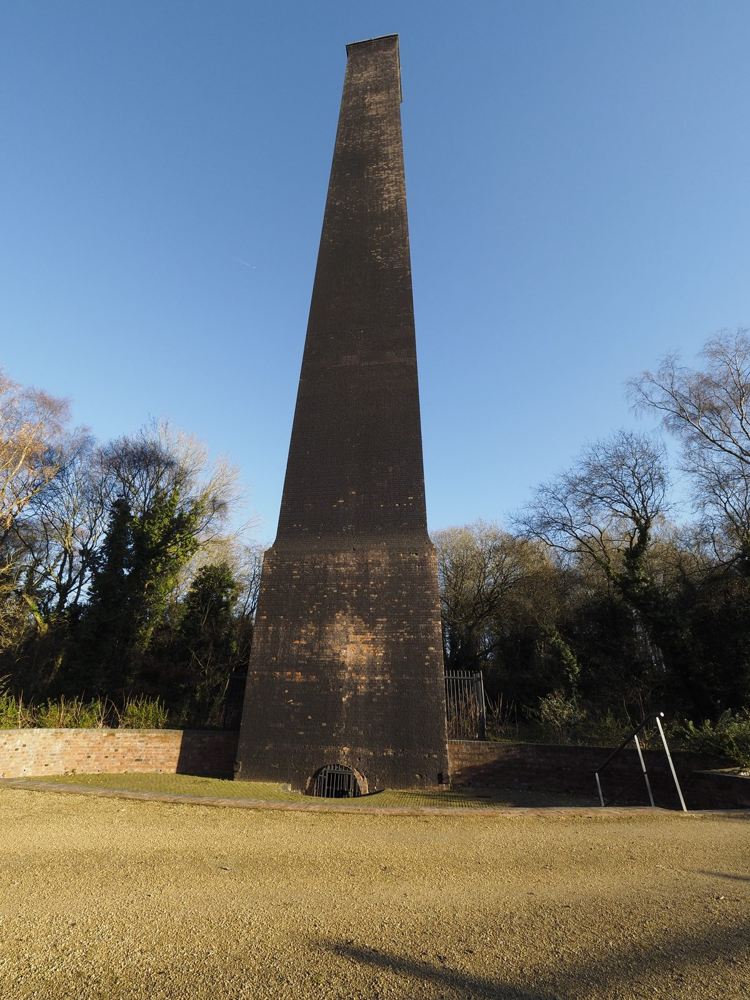
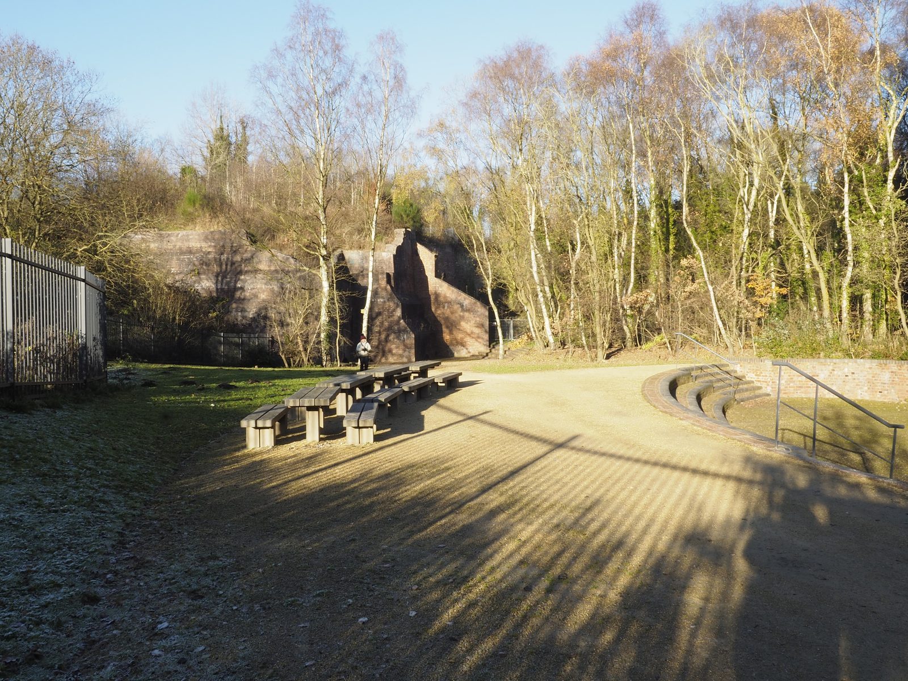
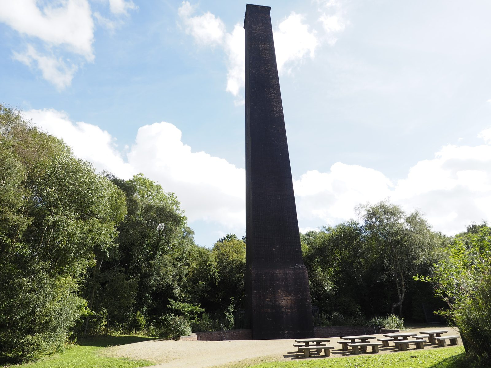
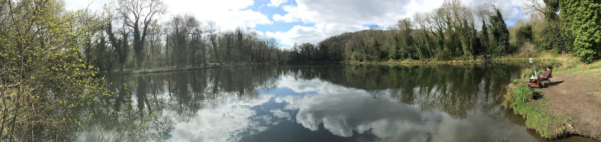

Have a look at some of our vital restoration and maintenance efforts. We work tirelessly with our friends and volunteers to ensure Telford Town Park receives the love it deserves.

## Some of our recent work

### 2024 — The Crannog Project

With the support of Simmonds Transport, the Friends are involved in a major project to repair and improve the Crannog and the area around Grange Pool — including repairing the seating area and bridge, painting benches and tables, clearing pathways, and planting hedgerow trees to support the banks. [Read more about the Crannog project](/news/2026-09-23-crannog-regeneration-project/).

### 19 August — Restoring the Chelsea and Maxell Gardens

The Friends of Telford Town Park were hard at work in the gardens and then enjoying a well-earned cup of tea and a chat.

Thank you to everyone for helping to keep the Chelsea and Maxell Gardens looking great.

### 3 August — Bench painting with Fujitsu

It was another lovely morning with the Fujitsu volunteers. We managed to paint many benches thanks to the hard work of the Friends and our volunteers.

Thanks everyone!

### 23 July — Clearing the overhanging trees from the footpaths

We had Friends and volunteers who helped to clear the overhanging trees from the old Stirchley Village School area and made it safe for pedestrians to walk along part of the footpath.

Thanks for all who helped out!

<!-- TODO: old site's photo for this entry was a stock image, not a real one — replace once sourced -->

## Gallery

Our volunteers are always helping us restore our beloved park! Photos from these past work sessions are in the [Around the park gallery](/gallery/around-the-park/):

- Tidying Grange Pool with Simmonds
- Bench painting with Fujitsu
- Kitchen building with Kitchen Depot
- Building the poly tunnel
- Clearing the snake and lizard sanctuary with Fujitsu
- Clearing the Stirchley old school entrance with Fujitsu

## Earlier projects

### 2010 — Reopening the Crannog

With a £2,760 "Awards for All" grant from the Big Lottery, the Friends replaced the old broken bridge to the Crannog on Grange Pool (Shropshire Council installed it), cleared the site and laid a path to the far end. In October 2010 the Friends and Telford Green Gym built a living willow hide there for watching the birds on the pool, and the Friends produced the [Crannog leaflet](/archive/crannog-leaflet/crannog-leaflet.pdf).

### Slag works survey

The Friends worked with archaeologist Paul Belford of Nexus Heritage on what was believed to be the first survey ever made of a slag-crushing plant, where waste slag from the local iron furnaces was turned into road-making material. The site is beside the easternmost footpath running south from Stirchley Chimney, and can be seen from the path.

### 2014–2015 — Telford, Our New Town

The Friends helped Telford & Wrekin Libraries with "Telford, Our New Town", a Heritage Lottery-funded project to create a digital archive of Telford's development in the 1960s–1980s, drawing on the Telford Development Corporation archive at Shropshire Archives. The libraries made a [film about the project](https://youtu.be/Ip3O1aUYVm4) in 2015.

## The Park We're Protecting

Telford Town Park was once a huge industrial site, and much of that heritage still survives alongside its green space today. The chimney is one of the park's most prominent landmarks: built in 1873 on the site of an earlier 18th-century ironworks, it stands 62 metres tall. The Abraham Darby monument marks 300 years since Darby's ironworking innovations put the area on the map. These are reminders of why our restoration work matters — protecting both the park's nature and its history for the future.

Telford Town Park was developed by Telford Development Corporation in the 1970s, to give the people of the new town a "green lung" in its centre, and was handed over to the local authority to manage in 1992. The north of the park, next to the town centre and Southwater, holds the Chelsea and Maxell Gardens, the play areas, the Arena and the Visitor Centre. The south, stretching towards Stirchley, Dawley and Aqueduct, is important for both wildlife and history, and much of it is a Local Nature Reserve: pools, pit mounds, heathland, woodland and meadows that grew up naturally on land left behind by industry, alongside the Stirchley Chimney site, which opened to the public on 21 August 2012 after restoration. The Silkin Way, a long-distance walking and cycling route, runs through the park, linking it to the Ironbridge Gorge to the south and Apley Castle to the north.

The area's recorded history goes back to the 12th century, when monks owned and farmed it; the name Stirchley comes from a meadow for livestock. The only relic of that time in the park is the Norman Chapel near the Withy Pool, which was carefully taken apart and moved there from its original site, where the House of Fraser store was later built. Much later, the Shropshire Canal through the park proved unsuccessful and was abandoned in favour of the railway from Coalport to Wellington. The last passenger train ran in 1952, and many of the railway's old fence posts can still be seen along its route.

To explore it yourself, follow the heritage and nature trails on the council's [Telford Town Park website](https://www.telfordtownpark.co.uk/info/34/walking_trails), which has leaflets to download.

